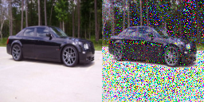

# Implementing Generative Diffusion Models and Concepts
This is a repository containing my learning and implementation of popular diffusion pipelines with the 
<a href="https://huggingface.co/docs/diffusers/index">``diffusers``</a> library.
I also dabble in in-painting experiments with <a href="https://arxiv.org/pdf/2301.07093.pdf">GLIGEN</a>.

### Requirements
> PyTorch

> Diffusers

> Accelerate

> Transformers (huggingface)

### Diffusion Todo:
- [x] DDPM training and results (Stanford Cars)

- [x] DDPM inference (Stanford Cars) 

- [x] Stable Diffusion v-1.4 inference

- [ ] LDM training and conditioning on custom embeddings

### Denoising Diffusion Probabilistic Models
#### Instructions
To train a DDPM on a dataset (find prepped datasets in ``config.py``):

``
cd ./src
``

``
python3 train.py --diffusion-method=ddpm --dataset-name=<your dataset> --run-name=<name of the training run>
``

By default, ``--dataset-name`` is set to ``"stanford-cars"``, ``--diffusion-method`` is set to ``ddpm``.

#### Results
Results of training a DDPM on the Stanford Cars dataset, using a Quadro RTX 5000 (16 GB VRAM). A sample of a noised sample at timestep 50 
using the linear scheduler is shown below:

Epoch 10:

Epoch 30:

Epoch 50:

### Stable Diffusion v-1.4
#### Instructions
To generate an image from a given text prompt using SD, first ``cd src`` and then:

``
python3 inference.py --diffusion-method=stable-diffision --sd-prompt="your prompt"
``

#### Results
By setting ``--sd-prompt`` as ``A realistic LSUN-like bedroom scene`` we get:

### Image Inpainting
Used ``gligen_experiments/inpainting_inference.py`` to add the following in LSUN bedroom scenes:

#### Objects
> a laptop

> a cat

> a book

> a bouquet of flowers

> a pile of clothes

#### Results
An example of inpainting the above objects at the location:

yields these results:

